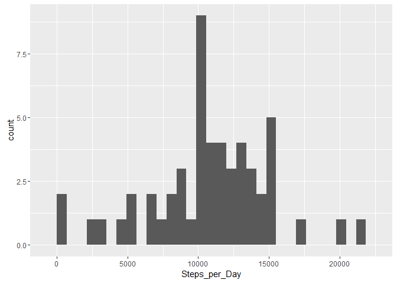
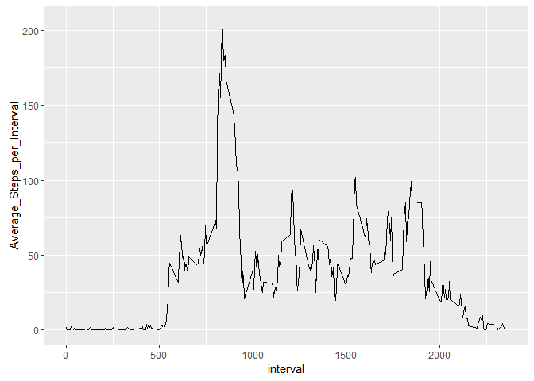
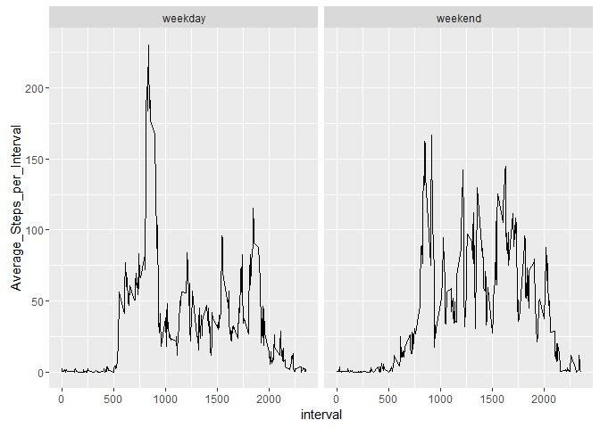

# Reproducible Research: Peer Assessment 1


## Loading and preprocessing the data
To buid this repport is necessary to use the following libraries.


```r
library(dplyr)
library(ggplot2)
library(lubridate)
```

The load the data to performe the analysis.

```r
dataSet <- read.csv("activity.csv")
head(dataSet)
```

```
##   steps       date interval
## 1    NA 2012-10-01        0
## 2    NA 2012-10-01        5
## 3    NA 2012-10-01       10
## 4    NA 2012-10-01       15
## 5    NA 2012-10-01       20
## 6    NA 2012-10-01       25
```

## What is mean total number of steps taken per day?


```r
x <- group_by(dataSet, date)
plotdata1 <- summarize(x, Steps_per_Day = sum(steps))
ggplot(plotdata1, aes(Steps_per_Day)) + geom_histogram()
```

<!-- -->

```r
stepsMean <- mean(plotdata1$Steps_per_Day, na.rm = TRUE)
stepsMedian <- median(plotdata1$Steps_per_Day, na.rm = TRUE)
```

The mean is 1.0766189\times 10^{4} and the median is 10765.

## What is the average daily activity pattern?


```r
y <- group_by(dataSet, interval)
plotdata2 <- summarize(y, Average_Steps_per_Interval = mean(steps, na.rm = TRUE))
ggplot(plotdata2, aes(interval,Average_Steps_per_Interval)) + geom_line()
```

<!-- -->

```r
maxSteps <- max(plotdata2$Average_Steps_per_Interval)
z <- filter(plotdata2, Average_Steps_per_Interval == maxSteps)
```

The 5-minute interval, on average across all the days in the dataset, that contains the maximum number (206.1698113) of steps is 835.

## Imputing missing values

The calculus for missing data is presented.

```r
countNA <- sum(is.na(dataSet$steps))
```

So, in this dataset there is 2304 NA values.

The strategy for filling in all of the missing values in the dataset use the mean for that each 5-minute interval. Then we create a new dataset that is equal to the original dataset but with the missing data filled in.


```r
newDataSet <- merge(dataSet,plotdata2)
newDataSet <- mutate(newDataSet, steps = ifelse(is.na(steps),Average_Steps_per_Interval ,steps))
head(newDataSet)
```

```
##   interval    steps       date Average_Steps_per_Interval
## 1        0 1.716981 2012-10-01                   1.716981
## 2        0 0.000000 2012-11-23                   1.716981
## 3        0 0.000000 2012-10-28                   1.716981
## 4        0 0.000000 2012-11-06                   1.716981
## 5        0 0.000000 2012-11-24                   1.716981
## 6        0 0.000000 2012-11-15                   1.716981
```


Make a histogram of the total number of steps taken each day and calculate and report the mean and median total number of steps taken per day.


```r
x1 <- group_by(dataSet, date)
plotdatax1 <- summarize(x1, Steps_per_Day = sum(steps))
ggplot(plotdatax1, aes(Steps_per_Day)) + geom_histogram()
```

<!-- -->

```r
stepsMeanx <- mean(plotdatax1$Steps_per_Day, na.rm = TRUE)
stepsMedianx <- median(plotdatax1$Steps_per_Day, na.rm = TRUE)
```

The new values for mean is 1.0766189\times 10^{4} and the median is 10765.

Do these values differ from the estimates from the first part of the assignment? What is the impact of imputing missing data on the estimates of the total daily number of steps?

NO CHANGES AT ALL!!!


## Are there differences in activity patterns between weekdays and weekends?

For this part the weekdays() function may be of some help here. Use the dataset with the filled-in missing values for this part.

Create a new factor variable in the dataset with two levels - "weekday" and "weekend" indicating whether a given date is a weekday or weekend day.


```r
newDataSet1 <- mutate(newDataSet, Day_type = ifelse(weekdays(as.Date(date))=="sábado"|weekdays(as.Date(date))=="domingo", "weekend", "weekday"))
head(newDataSet1)
```

```
##   interval    steps       date Average_Steps_per_Interval Day_type
## 1        0 1.716981 2012-10-01                   1.716981  weekday
## 2        0 0.000000 2012-11-23                   1.716981  weekday
## 3        0 0.000000 2012-10-28                   1.716981  weekend
## 4        0 0.000000 2012-11-06                   1.716981  weekday
## 5        0 0.000000 2012-11-24                   1.716981  weekend
## 6        0 0.000000 2012-11-15                   1.716981  weekday
```


Make a panel plot containing a time series plot (i.e. type = "l") of the 5-minute interval (x-axis) and the average number of steps taken, averaged across all weekday days or weekend days (y-axis).


```r
newDataSet1 <- mutate(newDataSet1, Day_type = as.factor(Day_type))

y1 <- group_by(newDataSet1, interval, Day_type)
y1
```

```
## Source: local data frame [17,568 x 5]
## Groups: interval, Day_type [576]
## 
##    interval    steps       date Average_Steps_per_Interval Day_type
##       <int>    <dbl>     <fctr>                      <dbl>   <fctr>
## 1         0 1.716981 2012-10-01                   1.716981  weekday
## 2         0 0.000000 2012-11-23                   1.716981  weekday
## 3         0 0.000000 2012-10-28                   1.716981  weekend
## 4         0 0.000000 2012-11-06                   1.716981  weekday
## 5         0 0.000000 2012-11-24                   1.716981  weekend
## 6         0 0.000000 2012-11-15                   1.716981  weekday
## 7         0 0.000000 2012-10-20                   1.716981  weekend
## 8         0 0.000000 2012-11-16                   1.716981  weekday
## 9         0 0.000000 2012-11-07                   1.716981  weekday
## 10        0 0.000000 2012-11-25                   1.716981  weekend
## # ... with 17,558 more rows
```

```r
plotdata2y1 <- summarize(y1, Average_Steps_per_Interval = mean(steps, na.rm = TRUE))
plotdata2y1
```

```
## Source: local data frame [576 x 3]
## Groups: interval [?]
## 
##    interval Day_type Average_Steps_per_Interval
##       <int>   <fctr>                      <dbl>
## 1         0  weekday                2.251153040
## 2         0  weekend                0.214622642
## 3         5  weekday                0.445283019
## 4         5  weekend                0.042452830
## 5        10  weekday                0.173165618
## 6        10  weekend                0.016509434
## 7        15  weekday                0.197903564
## 8        15  weekend                0.018867925
## 9        20  weekday                0.098951782
## 10       20  weekend                0.009433962
## # ... with 566 more rows
```

```r
p <- ggplot(plotdata2y1, aes(interval,Average_Steps_per_Interval)) + geom_line()
p+ facet_wrap(~ Day_type, ncol=2)
```

<!-- -->
